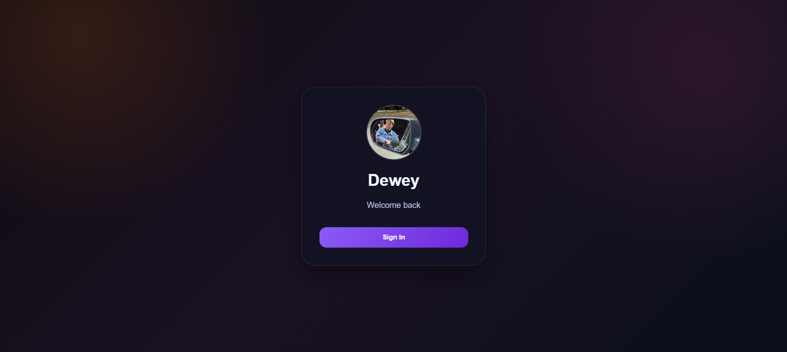

# DeweyOS Portfolio

A desktop-style portfolio designed to look and feel like a modern operating system.  
Built to showcase projects with a clean UI, draggable windows, and app-style navigation.

---

## Preview



---

## Features

- Draggable application windows  
- Desktop-style interface  
- Project explorer with folder-style navigation  
- Built-in browser for live demos  
- Music/web shortcut support  
- Smooth animations and glass-style UI  
- LocalStorage support for saving settings  

---

## Installation / Setup

1. Click the `<> Code` button on GitHub  
2. Select **Download ZIP**  
3. Extract the ZIP file to a folder  
4. Open `index.html` in your browser  

---

## Customization

Open `index.html` to update:

- Project names  
- Demo links (opens inside the browser window)  
- Source code links (GitHub or other)  
- Your name, profile image, and content  

### Additional Customization

- `style.css` – modify colors, layout, and visual style  
- `script.js` – control window behavior and interactions  

---

## Project Structure

```
DeweyOS-portfolio/
│
├── index.html
├── style.css
├── script.js
├── /Imgs
│   └── assets (icons, images, profile)
```

---

## Notes

- Some websites (such as YouTube) may not load inside the built-in browser due to iframe restrictions  
- This project is fully client-side and does not require a backend  

---

## License

This project is open for personal use and customization.
